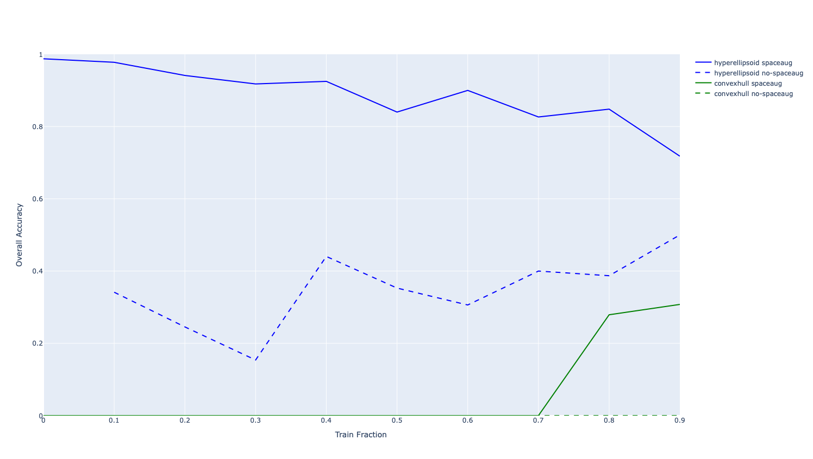

# Feature Regions

Exploring how features can be represented as regions instead of directions.

## Design Rationale

### Goals

1. **Generative** (as opposed to discriminative) — defined from one class's points only, so regions
  are modular.
2. **Bounded** (finite volume) without needing `~d` points, for generalization to unseen points of *different* classes.
3. **Full-dimensional** (>0 volume) without needing `~d` points, for generalization to unseen points of the *same* class.
4. **Sensitivity** — correctly includes members.
5. **Specificity** — correctly excludes non-members.

### Types of Regions

| Method | Generative | Bounded | Full-dimensional | Sensitivity | Specificity |
| --- | --- | --- | --- | --- | --- |
| Polytope (linear boundaries) | no | no | no | ~100% | ~100% |
| Convex hull + PCA | yes | yes | no | ~100% | ~100% |
| Hypersphere | yes | yes | yes | ~100% | ~10% |
| **Hyperellipsoid + shrinkage** | **yes** | **yes** | **yes** | **~90%** | **~90%** |

Hyperellipsoids + shrinkage hits the sweet spot across all desired properties.

## Experiments

### Sensitivity

Sensitivity measures how well fitted regions contain held-out members.
Regions are fitted on a training subset of concepts, then tested on
whether the remaining concepts' embeddings fall inside the fitted
region. The train fraction is swept from 0.0 to 0.9.

Each shape (hyperellipsoid, convex hull) is tested with and without
**spaceaug**. With spaceaug, original concepts always go to training,
and whitespace variants (` concept`, `concept `, ` concept `) are
split into train/test. Without spaceaug, the originals themselves
are split.

Key results:

- **Hyperellipsoid + spaceaug** dominates, achieving ~0.72–0.98
  accuracy across all train fractions.
- **Hyperellipsoid without spaceaug** is much lower (~0.15–0.50),
  showing that spaceaug provides a large boost.
- **Convex hull + spaceaug** only achieves nonzero accuracy at high
  train fractions.
- **Convex hull without spaceaug** is ~0 everywhere.