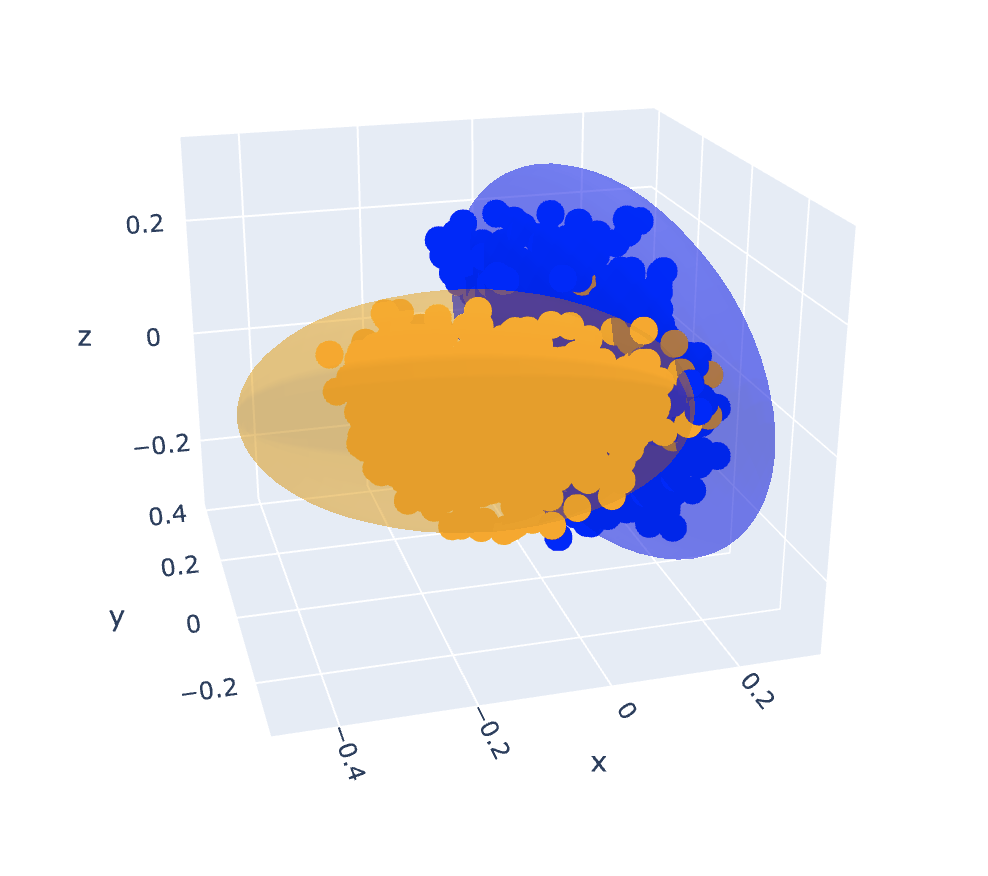

# Feature Regions

Exploring how features can be represented as regions instead of directions.

## Design Rationale

### Goals

1. **Generative** (as opposed to discriminative) — defined from one class's points only, so regions
  are modular.
2. **Full-dimensional** (>0 volume) without needing `~d` points, for generalization to unseen points of the *same* class.
3. **Bounded** (finite volume) without needing `~d` points, for generalization to unseen points of *different* classes.
4. **Sensitivity** — correctly includes members.
5. **Specificity** — correctly excludes non-members.
6. **Simple** - always good to be simple.

### Types of Regions

| Method | Full-dimensional | Generative | Bounded | Sensitivity | Specificity |
| --- | --- | --- | --- | --- | --- |
| Polytope (linear boundaries) | no | no | no | ~100% | ~100% |
| Convex hull + PCA | no | yes | yes | ~100% | ~100% |
| Hypersphere | yes | yes | yes | ~100% | ~10% |
| **Hyperellipsoid + shrinkage** | **yes** | **yes** | **yes** | **~90%** | **~90%** |

Hyperellipsoids have a good balance of all desired properties while having high sensitivity and high specificity.
