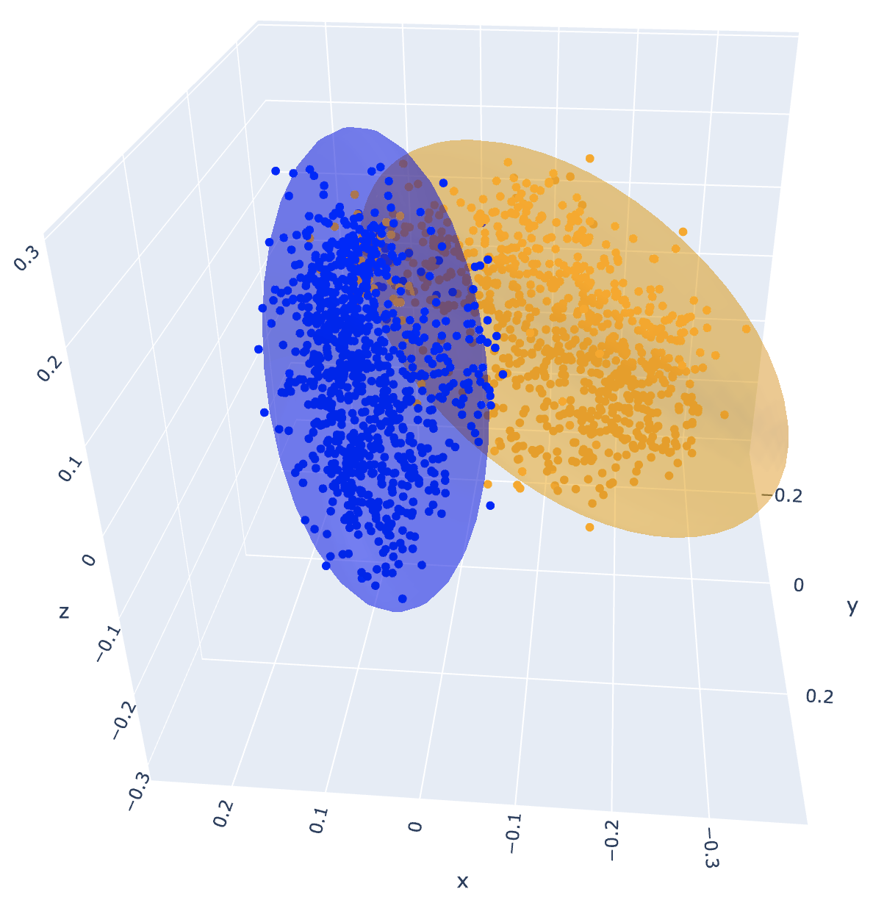
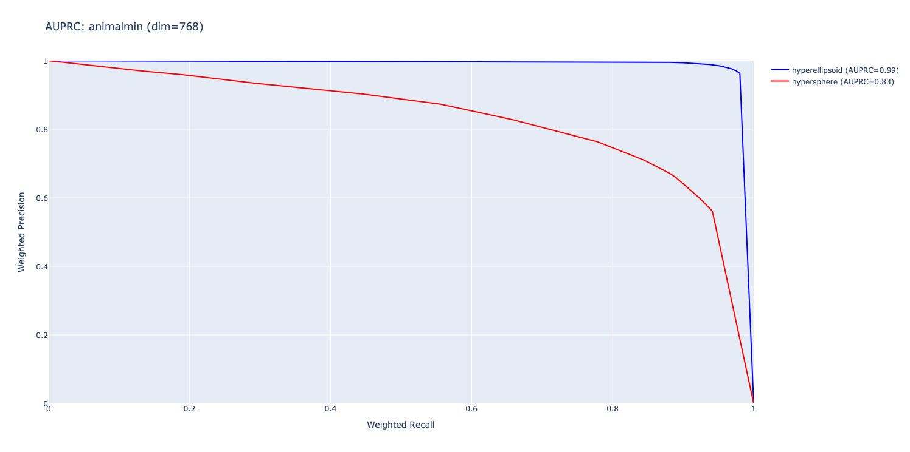

# Feature Regions




Exploring how features can be represented as regions instead of directions.

## Summary

This project studies the geometry of contiguous regions of related features (in text embeddings), finding that hyperellipsoids are a good approximation of feature regions with many desirable properties. It finds that hyperspheres are a poor approximation, which is somewhat surprising given that embeddings are most often compared with cosine similarity.

The project is inspired by [feature splitting](https://transformer-circuits.pub/2023/monosemantic-features) and [spatial structure](https://arxiv.org/abs/2410.19750) and seeks to explicitly model the geometry of these regions. It's related to [hierarchical geometry](https://arxiv.org/abs/2406.14172) but focuses on the geometry of individual categories rather than the structure between categories. It models a different kind of geometry than [non-linear features](https://arxiv.org/abs/2405.14860).

## Design

An ideal region geometry should have all of these properties:

1. **Generative** (as opposed to discriminative) — defined from one class's points only, so regions
  are modular.
2. **Bounded** (finite volume) without needing `O(d)` points, for generalization to unseen points of *different* classes.
3. **Full-dimensional** (>0 volume) without needing `O(d)` points, for generalization to unseen points of the *same* class.
4. **Precision & recall** — accurately modeling the shape of the feature region.
5. **Simplicity** - always good to have.

Some candidate geometries are:

1. **Linear separation polytope**: a polytope formed by the linear separation boundaries between all classes.
    - Pros: full-dimensional, near perfect precision & recall (almost all classes are linearly separable), simple.
    - Cons: discriminative, not bounded without `O(d)` classes.
2. **Hypersphere**: a hypersphere centered at the mean with radius equal to variance times a confidence threshold.
    - Pros: generative, bounded, full-dimensional, simple.
    - Cons: low precision & recall (see experiments).
3. **Hyperellipsoid + shrinkage**: a hyperellipsoid centered at the mean with radius equal to variance times a confidence threshold, and shrinkage coefficient to regularize the covariance matrix.
    - Pros: generative, bounded, full-dimensional with shrinkage, high precision & recall (see experiments), simple.
    - Cons: requires shrinkage to be full-dimensional, which is extra complexity.

## Experiments

### Precision & Recall



The AUPRC curve measures one-vs-rest classification quality across subtrees of a WordNet hypernym tree when building a hypersphere/ellipsoid over text embeddings of the nodes. It sweeps the confidence threshold to trace a precision-recall curve. Hyperellipsoid (0.98) strongly outperforms hypersphere (0.82), maintaining near-perfect precision across most recall levels.

The shapes are built with all points of the class (to test precision and recall). Generalization to unseen points of the same class is not tested.

To reproduce:

```bash
# animal is the largest tree and 768 is a middle dimension between 128 and 3072.
python auprc.py graph --tree-name animalmin --dimension 768
```

## Future Work

Since the shapes have volume, many things can be explored:
 - Comparing the volumes of regions in embedding/representation space for concepts at different depths of the tree (e.g. "animal" vs "mammal"/"bird")
 - Volume change of concepts in representation space throughout layers of an LLM, which can show how concepts are formed
 - Total volume of embedding/representation space covered by known regions, giving some quantification of how much of the space is "understood"